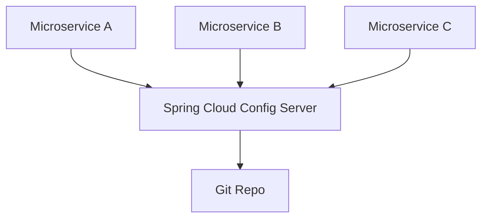
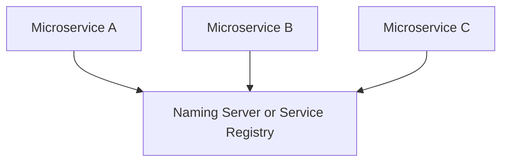
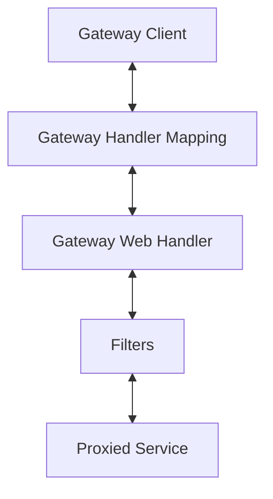

# Key Solutions for Microservices
## Spring Boot
Rapid development of REST APIs

## Spring Cloud
Umbrella project with multiple services for microservices architecture
### Centralized Configuration
Manage configuration for multiple microservices in central GIT repo

A typical application will have a lot of configurations;
1. External Services related
2. Database related
3. Queue related
4. App specific configs

In distributed micoservices architecture, we may have 100s of microservices, multiple environments and multiple instances of each microservice. Spring Cloud Config Server helps manage all these configs in a centralized GIT repo. We commit our configs to the GIT repo and the Spring Cloud Config Server ensures that all the microservices get the latest configs.

### Load Balancing
Distributes requests across active instances of microservices dynamically

### Service Discovery
Enable automatic discovery of microservices. It supports various services like Netflix Eureka, Apache Zookeeper

### Distributed Tracing
Trace requests across microservices. Important for troubleshooting issues. Spring supports Zipkin

### Edge Server / API Gateway
Single Entry point: Implement common features like authentication. Spring Cloud Gateway

1. Simple yet effective way to route to APIs
2. Provide cross cutting conferns: Security, Monitoring / Mertics
3. Built on top of Spring Webflux (Reactive approach)
4. Features: Match routes on any request attribute, Define Predicates and Filters, Integrates with Spring Cloud Discovery Client (Load Balancing)

### Fault Tolerance / Circuit Breaker
Ensure that failure in one microservice does not cascade and make other microservices to fail. Spring supports Resilience4J

## Docker
Containers - consistent deployment approach for microservices. Programming language and env. independent

## Kubernetes
Orchestrate thousands of microservices with advanced features (Services Discovery, Load Balanceing, Release Mgmt, ...)
