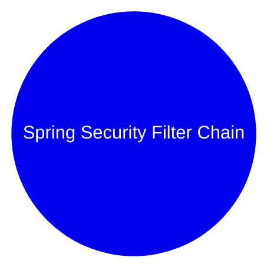

# spring-security
is one of the spring projects that help secure spring app resources including APIs, components and web-resources.

```mermaid
    mindmap
        root((Spring Security Filter Chain))
            
            
```
