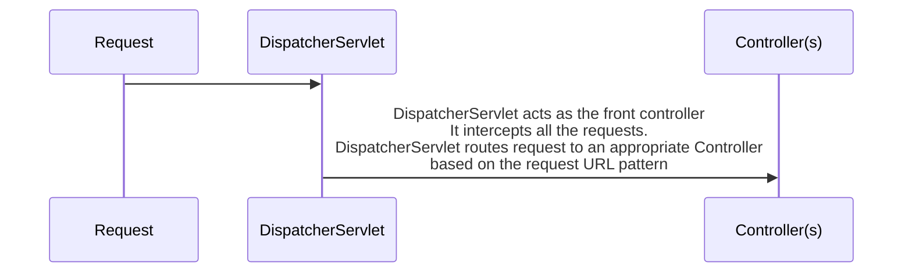
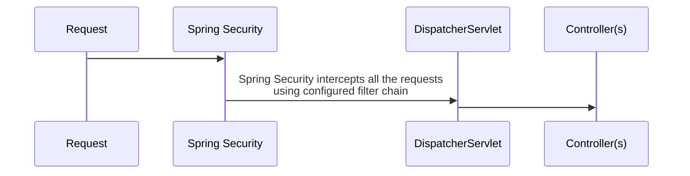
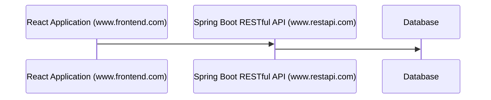

# spring-security
is one of the spring projects that help secure spring app resources including REST APIs, microservices and web apps.

By default, everything is protected. 

# spring-mvc flow

# spring-security flow

A filter chain will typically have multiple security filters configured.

# How spring-security works
Spring security executes a series of configured filters. Filters provides following features;
## Authentication
Example; BasicAuthenticationFilter
## Authorization
Example; AuthorizationFilter
## Others
### CORS (Cross Origing Resource Sharing)
Example; CorsFilter 
Checks if AJAX calls from other domains should be allowed.

### CSRF (Cross Site Request Forgery)
Example; CsrfFilter 
A malicious web-site making use of previous authenticated session on your website. It leverages existing cookies in your browser that may be tied to an active session.
### Default Login, Logout Pages
Examples; LogoutFilter, DefaultLoginPageGeneratingFilter, DefaultLogoutPageGeneratingFilter
### Excetion Translation
Examples; ExceptionTranslationFilter 
Exceptions are translated to HTTP codes. For example; 401 Access Denied, 403 Authorization Failed

# Order of filters
is important. Typical order;
## Basic Checks 
CORS, CSRF
## Authentication
## Authorization

 
# Default spring-security configuration
## Zero Trust
All requests are authenticated. It can be customized
## Form Authentication
is enabled with default form and logout features
## Basic Authentication
is  enabled
## Test User
is created. Credentails printed in logs. Username is <b>user</b>
## CSRF protection
is enabled for all update requests. POST, PUT, etc.
## CORS requests
are denied
## X-Frame-Options 
is set to 0 (Frames are disabled)
